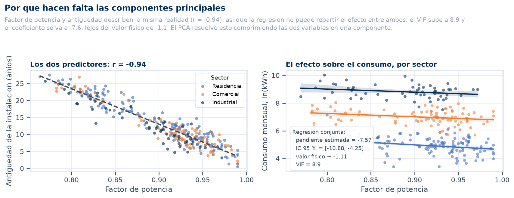

<div align="center">
    
</div>

# Análisis Multivariante y Creación de Dashboards Interactivos

## 📋 Información General

<div align="center">
    
</div>

| Aspecto | Detalles |
|--------|----------|
| **Autor** | Andrés Giovanny Rubiano Muñoz "Andy Rubiano" |
| **Correo** | arubiano67@unisalle.edu.co |
| **Asignatura** | Ciencia de Datos — Unidad 2, Actividad 6 |
| **Programa** | Maestría en Inteligencia Artificial |
| **Universidad** | Universidad de La Salle |
| **Herramientas** | Python 3.12 (scikit-learn · statsmodels · Matplotlib · Seaborn · Plotly · Dash) y R 4.6 (prcomp · kmeans · ggplot2 · plotly) |
| **Año** | 2026 |
| **Estado** | Completado |

---

## 🎯 Descripción del Proyecto

Segmentación de **300 clientes** de una distribuidora eléctrica colombiana a partir de **tres variables**: cuánto consume el cliente, con qué calidad eléctrica y desde hace cuánto. El proyecto recorre la cadena completa del análisis multivariante —comprobar supuestos, contrastar hipótesis, reducir dimensiones, agrupar y comunicar— y termina en un **dashboard interactivo** que rehace el análisis en vivo sobre el subconjunto que elija quien lo consulta.

Tres variables no son pocas por descuido: son las tres que el caso necesita. Un conjunto ancho, donde media docena de columnas miden lo mismo, no hace el análisis más riguroso —lo hace más difícil de leer y más fácil de contar mal.

### Lo que el análisis encuentra

| Resultado | Cifra |
|---|---|
| Variables → componentes retenidas | 3 → **2** |
| Información conservada | **98,4 %** de la varianza |
| Grupos descubiertos | **4** (silueta y Davies-Bouldin coinciden) |
| Silueta media | **0,484** |
| Concordancia K-Means ↔ Ward | ARI = **0,846** |
| Concordancia Python ↔ R | ARI = **1,000** (partición idéntica) |

Las dos componentes tienen lectura directa: **PC1 (65,3 %) es la calidad de la red** —el factor de potencia frente a la antigüedad, que se oponen— y **PC2 (33,1 %) es la escala de consumo**. El cruce de ambas produce cuatro segmentos, y uno de ellos —**C2: gran consumidor con red degradada**, 37 clientes con el mayor consumo (5 464 kWh), el peor factor de potencia (0,82) y la mayor antigüedad (21,2 años)— es el candidato natural a priorizar en un plan de inversión.

### Objetivos

- Aplicar pruebas de hipótesis univariantes y multivariantes (Shapiro-Wilk, Levene, t de Welch, regresión múltiple, ANOVA + Tukey, chi-cuadrado, MANOVA) y verificar la adecuación de los datos al PCA (Bartlett, determinante y KMO).
- Reducir la dimensionalidad con PCA e identificar segmentos con K-Means y agrupamiento jerárquico de Ward, validando la elección de *k* con cuatro índices.
- Construir visualizaciones avanzadas con **Matplotlib, Seaborn y Plotly** en Python y **ggplot2** en R, comparando lo que aporta cada herramienta.
- Publicar los resultados en un **dashboard interactivo** con identidad institucional.
- Verificar de forma cruzada que Python y R llegan al mismo resultado.

---

## 📚 Estructura del Repositorio

```
.
├── README.md                          # Este archivo
├── requirements.txt                   # Dependencias de Python
├── app.py                             # Punto de entrada del dashboard (puerto 8050)
├── assets/
│   └── dashboard.css                  # Armazón y estilos de los controles
├── data/
│   ├── dataset/
│   │   └── consumo_energia.csv        # 300 clientes × 6 columnas (semilla 42)
│   └── processed/                     # 30 tablas de resultados (Python y R)
├── public/
│   └── assets/
│       └── images/
│           ├── Logo.png · UnisalleDarkLogoV1.png   # versión clara y versión blanca
│           ├── author/                # Foto del autor
│           ├── screenshots/           # Capturas del dashboard
│           └── figures/
│               ├── python/
│               │   ├── multivariate/  # 6 figuras de PCA y clustering (Matplotlib)
│               │   ├── advanced/      # 6 figuras exploratorias (Seaborn)
│               │   └── interactive/   # 4 figuras interactivas (Plotly, HTML + PNG)
│               └── r/
│                   └── multivariate/  # 5 figuras ggplot2 + 1 interactiva (plotly)
├── src/                               # Dashboard (Dash)
│   ├── theme.py                       # Paleta institucional y componentes
│   ├── data.py                        # Carga y motor de análisis en vivo
│   ├── layout.py                      # Barra lateral y lienzo
│   ├── callbacks.py                   # Recálculo y siete figuras
│   └── dashboard.py                   # Ensamblaje de la aplicación
└── utils/
    └── codes/
        ├── python/
        │   ├── estilo.py              # Paleta compartida por todas las figuras
        │   ├── dataset.py             # Fase 0 · generación del conjunto de datos
        │   ├── hypothesis_tests.py    # Fase 1 · pruebas de hipótesis y adecuación
        │   ├── pca_clustering.py      # Fase 2 · PCA, selección de k y clustering
        │   ├── advanced_viz.py        # Fase 3 · visualización avanzada (Seaborn)
        │   └── interactive_viz.py     # Fase 4 · visualización interactiva (Plotly)
        └── R/
            └── multivariate.R         # Fase 5 · réplica y verificación cruzada
```

---

## 🧪 Pipeline del Laboratorio

El flujo es **secuencial**: cada fase consume lo que produjo la anterior, y las decisiones de modelado se toman a partir de los diagnósticos de la fase previa.

### Fase 0 · Generación del conjunto de datos

[`dataset.py`](utils/codes/python/dataset.py) simula 300 clientes a partir de **dos factores latentes**, no de tres variables independientes: si lo fueran, la matriz de correlación sería la identidad y el PCA no tendría nada que resumir.

- **Escala** — tamaño de la instalación (lognormal por sector, con solapamiento deliberado). De ella salen la potencia y las horas de operación, cuyo producto genera el consumo.
- **Calidad** — estado de la red. No es un continuo, sino una **mezcla de dos poblaciones**: el 62 % del parque pasó por un programa de modernización y el resto conserva la infraestructura original. Gobierna el factor de potencia y la antigüedad, y es la estructura que el clustering debe descubrir sin conocer la etiqueta.

El conjunto **observado** se queda en tres variables numéricas. La potencia, las horas y la temperatura participan en la simulación pero no se exportan: son magnitudes latentes que generan el consumo, no medidas que el sistema comercial de una distribuidora tenga cliente a cliente.

| Salida | Contenido |
|---|---|
| `data/dataset/consumo_energia.csv` | 300 clientes × 6 columnas: identificador, sector, región y las tres numéricas |

### Fase 1 · Pruebas de hipótesis y adecuación al PCA

[`hypothesis_tests.py`](utils/codes/python/hypothesis_tests.py) responde tres preguntas antes de reducir nada.

**¿Se cumplen los supuestos?**

| Prueba | Escala original | En logaritmo |
|---|---|---|
| Shapiro-Wilk (por sector) | p = 7,5·10⁻⁴ / 1,8·10⁻⁵ / 1,4·10⁻¹⁶ → **se rechaza** | p = 0,485 / 0,949 / 0,103 → **no se rechaza** |
| Levene (entre sectores) | W = 96,93 · p < 0,001 → **se rechaza** | W = 1,57 · p = 0,210 → **no se rechaza** |

El logaritmo recupera a la vez la normalidad y la homocedasticidad, así que todo lo que sigue trabaja sobre `log(consumo)`.

**¿Los grupos que ya conocemos son distintos?**

| Prueba | Resultado | Decisión (α = 0,05) |
|---|---|---|
| ANOVA `log(consumo) ~ sector` | F = 1 086,7 · η² = 0,880 | Se rechaza H₀ |
| Tukey HSD | Los tres pares difieren (p < 0,001) | Industrial consume 6,25× el comercial |
| Chi-cuadrado `sector × región` | χ² = 4,01 · p = 0,404 · V = 0,08 | **No** se rechaza → son independientes |
| MANOVA (sector sobre las tres variables) | Λ de Wilks = 0,109 · F = 200,2 · p ≈ 10⁻¹³⁸ | Se rechaza H₀ |
| t de Welch (Caribe vs Andina) | p = 0,898 · y p = 0,242 restringiendo a residencial | **No** se rechaza |

El contraste regional no detecta nada, y conviene reportarlo tal cual: el consumo está dominado por el tamaño de la instalación —que este conjunto no mide— y ese ruido entierra cualquier diferencia geográfica. Una prueba que no rechaza también informa.

**¿Por qué hace falta reducir dimensiones?** Ésta es la pregunta que enlaza con la Fase 2, y se responde con una regresión:

```
log(consumo) ~ factor_potencia + antiguedad_anios + sector
factor_potencia:   β = −7,57   IC 95 % = [−10,88; −4,25]   VIF = 8,9
antiguedad_anios:  β = −0,044  IC 95 % = [−0,074; −0,014]  VIF = 8,9
```

El generador fija el consumo proporcional a `0,92 / factor_potencia`, de modo que la pendiente física ronda **−1,1**. La estimación se va a −7,57 y su intervalo ni siquiera contiene el valor verdadero. Dos causas se suman: los predictores están correlacionados a −0,94 (de ahí el VIF de 8,9, muy por encima del umbral de 5) y el modelo omite el tamaño de la instalación. El coeficiente resultante no se puede interpretar — y ése es exactamente el problema que el PCA viene a resolver.

**¿Tiene sentido aplicar PCA?**

| Diagnóstico | Valor | Lectura |
|---|---|---|
| Esfericidad de Bartlett | χ²(3) = 701,9 · p < 0,001 | La matriz difiere de la identidad: el PCA es pertinente |
| Determinante de R | 0,094 | Lejos de 1: hay estructura que comprimir |
| KMO global | 0,430 | **No concluyente** |

Sobre el KMO conviene ser explícito en vez de esconderlo: el índice compara correlaciones simples con parciales, y con solo tres variables cada parcial se calcula controlando por una sola, de modo que las correlaciones anti-imagen quedan infladas por construcción. Kaiser lo pensó para baterías de muchos indicadores; con tres no decide nada. La pertinencia del PCA la sostiene Bartlett.

### Fase 2 · Componentes principales y clustering

[`pca_clustering.py`](utils/codes/python/pca_clustering.py) estandariza las tres variables —con logaritmo en el consumo— y extrae las componentes.

| Componente | Autovalor | Varianza | Interpretación |
|---|---|---|---|
| PC1 | 1,96 | 65,3 % | **Calidad de la red** — factor de potencia (+0,99) frente a antigüedad (−0,98) |
| PC2 | 1,00 | 33,1 % | **Escala de consumo** — log del consumo (+0,99) |
| PC3 | 0,05 | 1,6 % | Residuo: lo poco que separa a las dos variables de red |

**Aquí el criterio de Kaiser deja de servir.** Sobre matriz de correlaciones el autovalor medio vale 1 por construcción, así que "autovalor > 1" significa "por encima del promedio". Con tres variables PC2 se queda en 0,9975 y Kaiser la descartaría por dos milésimas, pese a recoger un tercio de la información y ser la única componente que mide el consumo. Se retiene por **varianza acumulada del 80 %** —dos componentes, 98,4 %— y la tabla sigue reportando Kaiser al lado para dejar la discrepancia a la vista.

**Una decisión que cambia el resultado.** El clustering no se hace sobre las puntuaciones crudas, sino sobre las **componentes retenidas estandarizadas**. Las crudas heredan la varianza del autovalor (1,96 frente a 1,00), de modo que la distancia euclídea quedaría dominada por PC1 y K-Means partiría a los clientes solo por el estado de su red, ignorando cuánto consumen.

**Selección de k.** Los cuatro índices se calculan para k = 2…8:

| k | Inercia | Silueta | Calinski-Harabasz | Davies-Bouldin |
|---|---|---|---|---|
| 2 | 358,7 | 0,416 | 200,5 | 1,052 |
| 3 | 199,3 | 0,454 | 298,6 | 0,748 |
| **4** | **130,5** | **0,484** ↑ | 355,0 | **0,692** ↓ |
| 5 | 101,3 | 0,464 | 363,3 ↑ | 0,715 |
| 6 | 86,7 | 0,415 | 348,3 | 0,782 |

Calinski-Harabasz alcanza su máximo en k = 5, pero por un margen estrecho (363 frente a 355) mientras la silueta y Davies-Bouldin apuntan con claridad a 4. Cuando los índices discrepan así, la parsimonia decide.

**Validación.** El agrupamiento jerárquico de Ward, con una lógica distinta, llega casi a la misma partición (ARI = 0,846): la estructura es de los datos, no del método.

### Fase 3 · Visualización avanzada con Seaborn

[`advanced_viz.py`](utils/codes/python/advanced_viz.py) produce seis figuras que responden preguntas del analista, no del modelo: matriz de correlación anotada, matriz de dispersión por grupo (`PairGrid`, seis paneles legibles), **clustermap** con dendrograma marginal, perfil de clústeres en puntuaciones z, violines por grupo y la versión gráfica de la regresión que motiva el PCA.

### Fase 4 · Visualización interactiva con Plotly

[`interactive_viz.py`](utils/codes/python/interactive_viz.py) exporta cuatro figuras en **HTML** —biplot con detalle por cliente, dispersión 3D rotable, coordenadas paralelas con filtros arrastrables y sunburst de composición— y en PNG para el informe.

Como el modelo usa exactamente tres variables, la dispersión 3D no es una proyección: es el espacio completo del análisis, sin pérdida. Las cuatro figuras comparten una única copia de `plotly.min.js` depositada en la carpeta, así que se abren con doble clic, sin servidor ni conexión, siempre que la carpeta viaje completa.

### Fase 5 · Réplica en R y verificación cruzada

[`multivariate.R`](utils/codes/R/multivariate.R) lee el mismo CSV y rehace todo con `prcomp`, `kmeans`, `hclust` y `cluster::silhouette`.

| Comprobación | Python | R | Diferencia |
|---|---|---|---|
| Autovalor de PC1 | 1,9640 | 1,9574 | 0,0066 |
| Varianza acumulada en 2 componentes | 98,39 % | 98,39 % | 0,00 |
| k elegido por silueta | 4 | 4 | — |
| Silueta media | 0,4836 | 0,4836 | 0,0000 |
| **Partición de los 300 clientes** | — | — | **ARI = 1,000** |

La diferencia en autovalores es el denominador de la desviación típica (*n* frente a *n*−1) y no altera ningún porcentaje. La partición es **idéntica cliente a cliente**: 64 / 98 / 37 / 101 en ambos lenguajes.

Dos indeterminaciones se resuelven de forma explícita para que las figuras de una y otra fase se puedan comparar lado a lado:

- **El signo de cada componente** es arbitrario (si **v** es autovector, −**v** también lo es) y `prcomp` y scikit-learn lo resuelven distinto. Se fija el convenio de que la variable con mayor carga absoluta quede positiva.
- **La numeración de los grupos** depende del orden de inicialización de los centroides, y R numera desde 1 mientras Python lo hace desde 0. Los grupos de R se renumeran por solapamiento máximo con los de Python.

---

## 📊 Los cuatro segmentos

| Grupo | n | Consumo medio | F. potencia | Antigüedad |
|---|---:|---:|---:|---:|
| **C0** · consumidor pequeño, red degradada | 64 | 214,2 kWh | 0,83 | 20,9 años |
| **C1** · gran consumidor, red confiable | 98 | 3 473,0 kWh | 0,93 | 9,4 años |
| **C2** · gran consumidor, red degradada | 37 | 5 464,5 kWh | 0,82 | 21,2 años |
| **C3** · consumidor pequeño, red confiable | 101 | 175,1 kWh | 0,94 | 9,0 años |

Tres lecturas que sostiene la evidencia:

1. **Los grupos cruzan la etiqueta de sector, no la reproducen.** C1 y C2 mezclan clientes comerciales e industriales; C0 y C3 dividen a los residenciales en dos poblaciones que la etiqueta administrativa no distinguía. La segmentación aporta información que el sector no tenía.
2. **La geografía no interviene.** El reparto por región es prácticamente uniforme entre los cuatro grupos, coherente con el chi-cuadrado que no rechazó la independencia entre sector y región. La partición responde al perfil eléctrico del cliente.
3. **C2 es el segmento accionable.** Son 37 clientes —el 12 % del padrón— que combinan el mayor consumo con el peor estado de red: un factor de potencia de 0,82 implica pérdidas por reactiva, y concentrar ese deterioro en los clientes de mayor facturación es donde el costo de la falla es más alto.

### Las puntuaciones z que dan nombre a los grupos

| Grupo | log Consumo | F. potencia | Antigüedad |
|---|---:|---:|---:|
| C0 | −0,71 | −1,16 | +1,21 |
| C1 | +0,87 | +0,49 | −0,59 |
| C2 | +1,19 | −1,39 | +1,25 |
| C3 | −0,83 | +0,76 | −0,65 |

Las z se calculan sobre la matriz transformada, la misma que usa el PCA. Con el consumo en su escala original la cola industrial infla la desviación típica y comprime a todos los demás: un grupo de 3 473 kWh —veinte veces la media residencial— se quedaría en z = 0,46 y parecería moderado. En logaritmo, que es donde el consumo se distribuye de forma simétrica, la z dice lo que se espera que diga.

---

## 🖼️ Galería

### El dashboard interactivo

<div align="center">
    
</div>

**Vista general** — indicadores, plano de componentes con las cargas superpuestas y varianza explicada. La barra lateral filtra por sector y región, ajusta *k* y permite colorear el plano por grupo descubierto, sector declarado o región, que es la forma directa de comprobar si la segmentación reproduce lo que ya se sabía o aporta algo nuevo.

<div align="center">
    
</div>

**La página no se desplaza: lo hace el lienzo.** El dashboard ocupa exactamente la altura de la ventana y se reparte en dos columnas de altura completa; el scroll vive dentro de la derecha. Así la barra lateral —con sus filtros y la firma— queda siempre entera y a mano, y el encabezado se mantiene pegado arriba: da igual a qué altura del análisis se esté, los controles y el título nunca se pierden de vista.

<div align="center">
    
</div>

**Autoría en la propia herramienta** — el pie de la barra lateral acompaña siempre al análisis, de modo que el dashboard queda firmado sin depender del documento que lo presenta. El encabezado repite la atribución junto al título.

<div align="center">
    
</div>

**El dashboard recalcula, no filtra.** Al restringir la vista al sector industrial no se ocultan puntos: se vuelve a estandarizar, extraer componentes y agrupar sobre esos clientes. El resultado es otro, y los nombres de los segmentos cambian con él: lo que a escala global es un "consumidor pequeño" pasa a ser "medio-alto" dentro del industrial. El PCA de un subconjunto no es el PCA global mirado de cerca.

<div align="center">
    
</div>

**Vista completa** — todo el lienzo desenrollado en una sola imagen: bajo el plano principal quedan las cargas, los perfiles en z, las coordenadas paralelas, la composición por sector y región, la matriz de correlaciones y la tabla de perfiles.

### Componentes principales y clustering (Python · Matplotlib)

| | |
|---|---|
|  |  |
| **Sedimentación** — dos componentes acumulan el 98,4 % | **Biplot** — factor de potencia y antigüedad se oponen sobre PC1; el consumo sube por PC2 |
|  |  |
| **Selección de k** — el codo sugiere, la silueta decide | **Partición** — los cuatro grupos ocupan un cuadrante cada uno |

| | |
|---|---|
|  |  |
| **Silueta por cliente** — dónde la asignación es dudosa | **Ward** — la alternativa que no exige fijar *k* de antemano |

### Exploración avanzada (Python · Seaborn)

<div align="center">
    
</div>

**Por qué hacen falta las componentes principales** — el panel izquierdo muestra el problema (los dos predictores caen casi sobre una recta, r = −0,94) y el derecho su consecuencia (una pendiente de −7,57 cuando el valor físico ronda −1,1). Es la figura que enlaza la Fase 1 con la Fase 2.

| | |
|---|---|
|  |  |
| **Correlaciones** — el −0,94 que el PCA comprime | **Dispersión por grupo** — seis paneles, uno por par |

<div align="center">
    
</div>

**Clustermap** — es la única figura que muestra el resultado cliente por cliente en vez de por promedios. El dendrograma de la izquierda reordena a los 300 clientes por similitud sin conocer la partición, y forma los mismos bloques que K-Means marca en la franja de color: la estructura se sostiene individuo a individuo.

| | |
|---|---|
|  |  |
| **Perfil en z** — la tabla de interpretación hecha figura | **Violines** — la forma completa, no solo los cuartiles |

### Figuras interactivas (Python · Plotly)

Se abren con doble clic, sin servidor ni conexión, mientras la carpeta que los contiene viaje completa (comparten `plotly.min.js`).

| Figura | Interacción | Archivo |
|---|---|---|
|  | Del punto atípico al cliente que lo produce | [`01_biplot_interactivo.html`](public/assets/images/figures/python/interactive/01_biplot_interactivo.html) |
|  | Rotar el espacio completo del modelo | [`02_dispersion_3d.html`](public/assets/images/figures/python/interactive/02_dispersion_3d.html) |
|  | Arrastrar un intervalo sobre cualquier eje filtra el resto | [`03_coordenadas_paralelas.html`](public/assets/images/figures/python/interactive/03_coordenadas_paralelas.html) |
|  | Clic en un anillo para profundizar | [`04_sunburst_composicion.html`](public/assets/images/figures/python/interactive/04_sunburst_composicion.html) |

### Réplica en R (ggplot2)

| | |
|---|---|
|  |  |
| **Sedimentación** — mismos autovalores que scikit-learn | **Biplot** — misma orientación tras fijar el signo de las componentes |
|  |  |
| **Silueta con `cluster::silhouette`** — máximo en k = 4 | **Partición** — idéntica a la de Python, cliente a cliente |

<div align="center">
    
</div>

**Perfil en R** — mismas cifras que la versión de Seaborn, construidas con `geom_tile`. R aporta además su propia figura interactiva, [`06_clusters_interactivo.html`](public/assets/images/figures/r/multivariate/06_clusters_interactivo.html), generada con `plotly` y `htmlwidgets`.

---

## ⚖️ Comparación de herramientas

Las cinco bibliotecas no compiten: cada fase usa la que resuelve su problema con menos fricción.

| Herramienta | Dónde se usa | Por qué esa y no otra |
|---|---|---|
| **Matplotlib** | Fase 2 — figuras del modelo | Control absoluto del lienzo. El biplot exige dibujar flechas desde el origen, escalarlas a la nube de puntos y colocar cada etiqueta fuera de su punta sin que se pisen; nada de eso existe como primitiva en las bibliotecas de alto nivel. |
| **Seaborn** | Fase 3 — exploración | Tres capacidades que en Matplotlib costarían decenas de líneas: mapa de calor anotado con paleta divergente centrada, `PairGrid` por grupos y `clustermap`, que reordena las filas por similitud y dibuja el dendrograma en el margen. |
| **Plotly** | Fase 4 — comunicación | Cambia el contrato: el lector hace zoom, aísla series, rota el espacio y lee los datos de un cliente al pasar el cursor. La interpretación deja de estar cerrada de antemano. |
| **Dash** | Dashboard | Convierte las figuras de Plotly en una aplicación con estado. El valor no es mostrar gráficas, sino **rehacer el análisis** con cada interacción. |
| **ggplot2** | Fase 5 — verificación | La gramática de gráficos hace que replicar una figura sea describirla, no reconstruirla. Al ser una implementación independiente, es una verificación real y no una repetición del mismo código. |

Dos apuntes prácticos encontrados al construirlo:

- **Seaborn no siempre gana.** `clustermap` monta sus ejes sobre un *gridspec* propio que ignora `tight_layout`, y la barra de color es una celda de esa rejilla: hay que bajar el techo a mano y reposicionarla después. Matplotlib puro habría sido más predecible, pero no habría dado el dendrograma marginal.
- **La ergonomía de Plotly tiene aristas.** Una anotación con flecha ancla el texto en la cola, no en la punta, así que un biplot necesita dos anotaciones por vector. Y si un `tickval` cae justo en el extremo del rango, el número se imprime dos veces sobre el mismo punto del eje.

---

## ⚙️ Requisitos

### Python

> ⚠️ **Versión:** Python 3.10 o superior (probado en **3.12.10**), con entorno virtual dedicado.

| Dependencia | Versión probada | Uso |
|---|---|---|
| `numpy` | 2.5.2 | Cálculo numérico |
| `pandas` | 3.0.5 | Manejo de datos y tablas de resultados |
| `scipy` | 1.18.1 | Shapiro-Wilk, Levene, t de Welch, chi-cuadrado, dendrograma |
| `statsmodels` | 0.14.6 | Regresión, ANOVA, Tukey y MANOVA |
| `scikit-learn` | 1.9.0 | PCA, K-Means, jerárquico y métricas de validación |
| `matplotlib` | 3.11.1 | Figuras de la Fase 2 |
| `seaborn` | 0.13.2 | Figuras de la Fase 3 |
| `plotly` | 6.9.0 | Figuras interactivas y del dashboard |
| `dash` | 4.4.1 | Dashboard |
| `kaleido` | 1.3.0 | Exportación de las figuras de Plotly a PNG |

### R

- **R 4.x** (probado en **4.6.1**) con `ggplot2`, `cluster` y `plotly`. Sin dependencias adicionales: `prcomp`, `kmeans` y `hclust` son de la instalación base.
- Editor: RStudio Desktop o VS Code con la extensión **R** (REditorSupport) + `languageserver`.

---

## 🛠️ Ejecución

Todos los comandos se lanzan **desde la raíz del proyecto**.

```bash
# 1. Entorno de Python
python -m venv .venv
source .venv/Scripts/activate        # Git Bash (en PowerShell: .venv\Scripts\activate)
pip install -r requirements.txt

# 2. Pipeline de análisis, en orden
python utils/codes/python/dataset.py            # Fase 0 · dataset
python utils/codes/python/hypothesis_tests.py   # Fase 1 · pruebas de hipótesis
python utils/codes/python/pca_clustering.py     # Fase 2 · PCA y clustering
python utils/codes/python/advanced_viz.py       # Fase 3 · figuras de Seaborn
python utils/codes/python/interactive_viz.py    # Fase 4 · figuras de Plotly

# 3. Réplica en R y verificación cruzada
Rscript utils/codes/R/multivariate.R            # Fase 5

# 4. Dashboard interactivo
python app.py                                   # http://localhost:8050/
```

> Las fases 3, 4 y 5 leen `data/processed/clientes_con_cluster.csv`, así que la Fase 2 debe haberse ejecutado antes. Los scripts avisan y se detienen si falta.

**Notas de reproducibilidad y de entorno**

- **Semilla fija** (`default_rng(42)` en Python, `set.seed(42)` en R): cualquier ejecución reproduce el mismo CSV, las mismas figuras y las mismas cifras de este README.
- **Rutas**: Python las resuelve desde la ubicación del script (`Path(__file__)`) y R con un `script_path()` que funciona en `Rscript`, `source()` y el botón *Source* de RStudio. Ninguno depende del directorio de trabajo.
- **La carpeta de estilos del dashboard** se declara de forma explícita (`assets_folder`), porque Dash la busca junto al módulo donde se crea la aplicación —`src/`— y aquí vive en la raíz.
- **Si `kaleido` no encuentra un navegador**, los scripts avisan y continúan: el HTML interactivo es el entregable real y el PNG solo alimenta el informe.

---

## 🔑 Palabras Clave

`Análisis Multivariante` · `PCA` · `K-Means` · `Clustering Jerárquico` · `Pruebas de Hipótesis` · `MANOVA` · `Multicolinealidad` · `Bartlett y KMO` · `Dashboard Interactivo` · `Dash` · `Plotly` · `Seaborn` · `ggplot2` · `scikit-learn` · `Ciencia de Datos`

---

## 📧 Contacto

**Andrés Giovanny Rubiano Muñoz**
Maestría en Inteligencia Artificial · Universidad de La Salle
arubiano67@unisalle.edu.co

---

## 📄 Derechos Reservados

© 2026 Andrés Giovanny Rubiano Muñoz (Andy Rubiano). Todos los derechos reservados.

Este laboratorio y su contenido —código, datos y documentación— son propiedad intelectual conjunta de:

- **Andrés Giovanny Rubiano Muñoz** (Andy Rubiano) — Autor
- **Universidad de La Salle** — Institución académica

El uso, reproducción o distribución requiere autorización previa escrita de los titulares de derechos.

---

<div align="center">
  Universidad de La Salle | Bogotá D. C., Colombia
</div>
