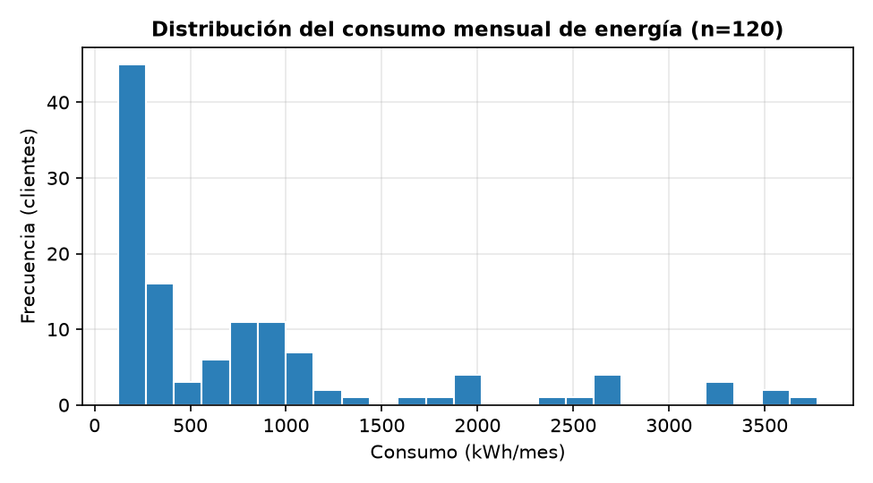
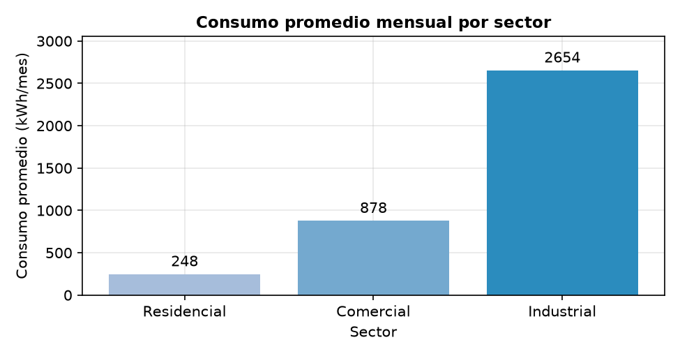
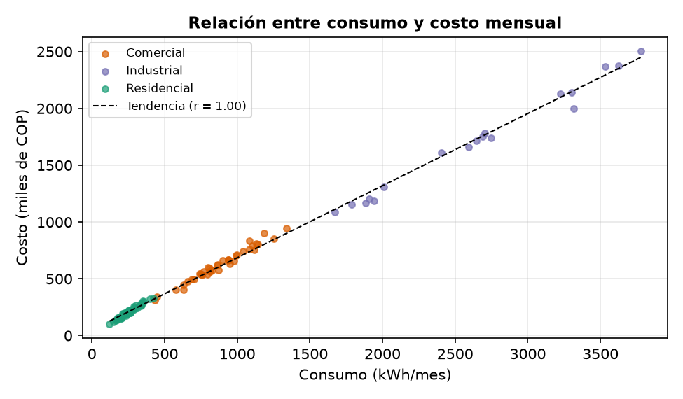
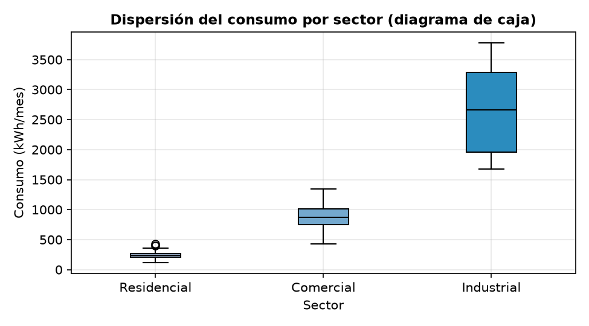
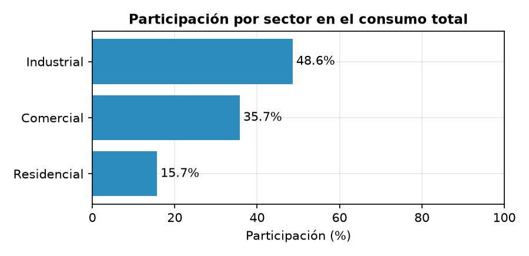
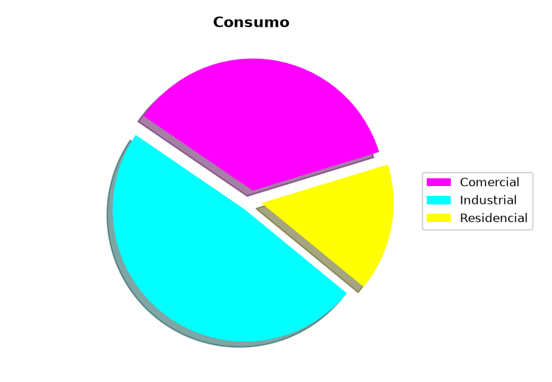
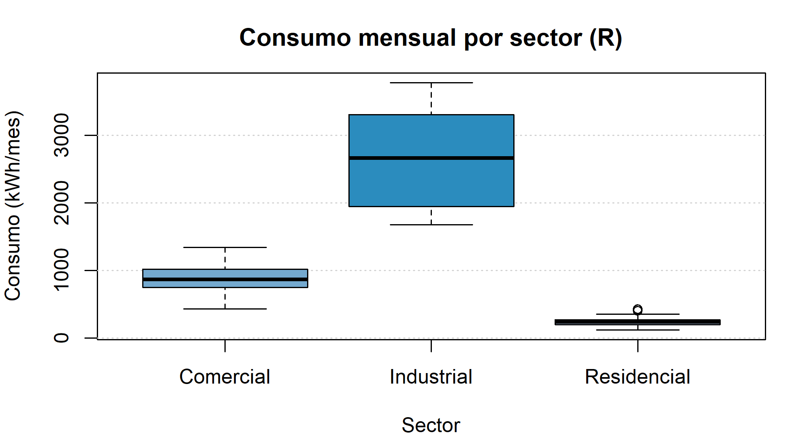
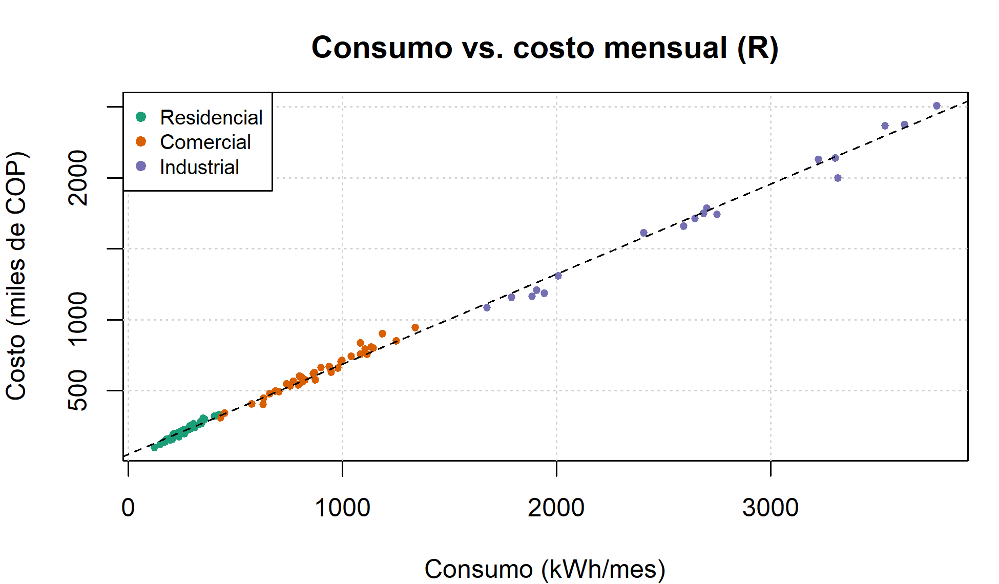
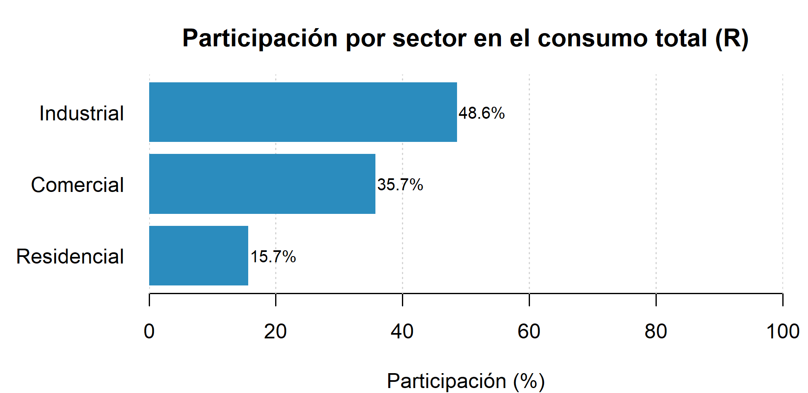
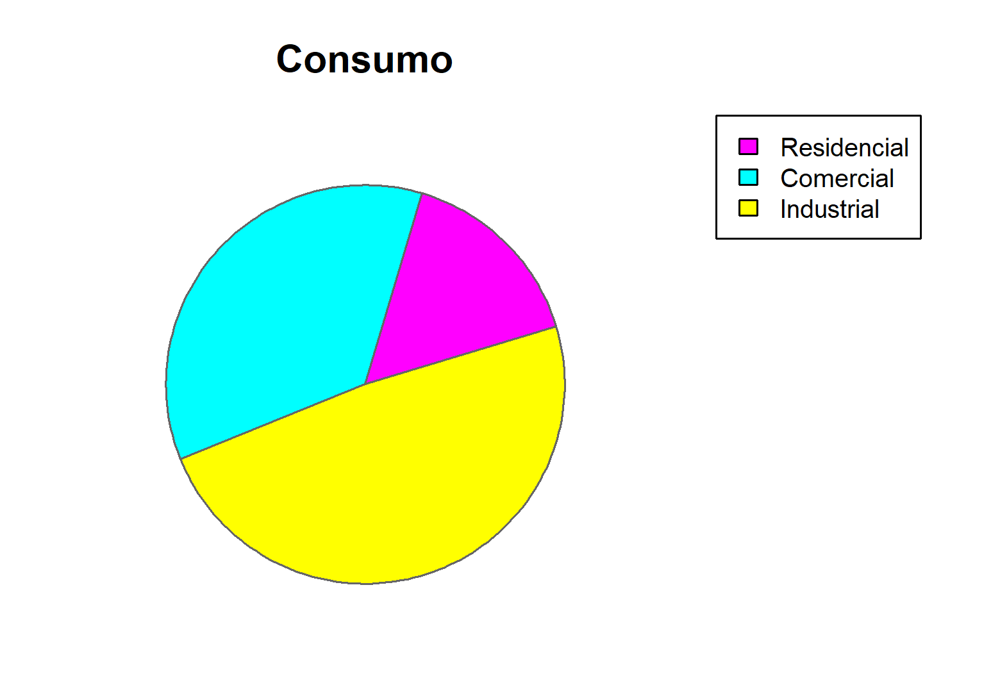

<div align="center">
    
</div>

# Introducción a la Visualización de Datos y Principios de Diseño de Gráficos

## 📋 Información General

<div align="center">
    
</div>

| Aspecto | Detalles |
|--------|----------|
| **Autor** | Andrés Giovanny Rubiano Muñoz "Andy Rubiano" |
| **Correo** | arubiano67@unisalle.edu.co |
| **Asignatura** | Ciencia de Datos — Actividad 1 |
| **Programa** | Maestría en Inteligencia Artificial |
| **Universidad** | Universidad de La Salle |
| **Herramientas** | Python 3.12 (Matplotlib + pandas + NumPy) y R 4.6 (graficación base) |
| **Año** | 2026 |
| **Estado** | Completado |

---

## 🎯 Descripción del Proyecto

Laboratorio de **visualización de datos** sobre un conjunto de datos simulado de consumo energético mensual de **120 clientes** de una empresa distribuidora de energía (sectores Residencial, Comercial e Industrial). El proyecto aplica los **principios de diseño de gráficos** (integridad gráfica, razón dato-tinta, etiquetado completo, uso funcional del color) mediante:

- **Estadística descriptiva** por sector (media, mediana, desviación estándar) y correlación de Pearson entre consumo y costo.
- **Gráficos básicos bien diseñados** en Python (histograma, barras, dispersión con regresión, diagrama de caja y barras horizontales de participación), con tres de ellos replicados en R.
- **Análisis crítico de diseño:** una gráfica intencionalmente mal diseñada (torta con título vago, colores saturados y sin etiquetas) frente a su versión corregida (barras horizontales ordenadas).
- **Verificación cruzada entre herramientas:** los estadísticos calculados en Python y en R coinciden (r = 0,998), validando el análisis.

### Objetivos Principales

- Crear y evaluar visualizaciones de datos efectivas utilizando Matplotlib en Python y RStudio.
- Aplicar principios esenciales de diseño gráfico en la construcción de cada figura.
- Comparar herramientas de visualización, con énfasis en Matplotlib y justificación de su elección.
- Contrastar ejemplos de gráficos bien y mal diseñados sobre los mismos datos.

---

## 📚 Estructura del Repositorio

```
.
├── README.md                             # Este archivo
├── requirements.txt                      # Dependencias de Python
├── .gitignore                            # Excluye .venv/, __pycache__/, .Rhistory, .vscode/
├── data/
│   ├── dataset/
│   │   └── consumo_energia.csv           # Dataset generado (semilla 42, reproducible)
│   └── processed/
│       ├── stats_by_sector.csv           # Media, mediana, desviación, mín. y máx. por sector
│       └── corr.txt                      # Correlación de Pearson consumo-costo
├── public/
│   └── assets/
│       └── images/
│           ├── Logo.png                  # Logo institucional
│           ├── author/                   # Foto del autor
│           └── figures/
│               ├── python/               # Figuras generadas con Matplotlib
│               │   ├── good_design/      # hist, bar, scatter, boxplot, barh (5)
│               │   └── bad_design/       # torta mal diseñada (análisis crítico)
│               └── r/                    # Figuras generadas con R base
│                   ├── good_design/      # boxplot, scatter, barh (3)
│                   └── bad_design/       # torta mal diseñada (análisis crítico)
└── utils/
    └── codes/
        ├── visualizations.py             # Genera dataset, estadísticos y figuras (Python)
        └── visualizations.R              # Replica figuras y verifica estadísticos (R)
```

---

## 🧪 Pipeline del Laboratorio

El flujo es **secuencial**: Python genera los datos y sus figuras; R consume el mismo CSV y replica el análisis, permitiendo la verificación cruzada.

### Fase 1 · Generación y análisis en Python

[`visualizations.py`](utils/codes/visualizations.py) construye el dataset simulado con distribuciones normales por sector y semilla fija (`default_rng(42)`), calcula la estadística descriptiva y produce las figuras con Matplotlib.

| Salida | Ubicación | Descripción |
|---|---|---|
| Dataset | `data/dataset/consumo_energia.csv` | 120 registros: cliente, sector, consumo (kWh), costo (miles COP) |
| Estadísticos | `data/processed/` | Media, mediana, desviación por sector + correlación de Pearson |
| Figuras bien diseñadas | `public/assets/images/figures/python/good_design/` | 5 gráficas con título, unidades, cuadrícula sutil y etiquetas de datos |
| Figura mal diseñada | `public/assets/images/figures/python/bad_design/` | Torta con errores intencionales para el análisis crítico |

### Fase 2 · Réplica y verificación en R

[`visualizations.R`](utils/codes/visualizations.R) lee el CSV generado en la Fase 1 y replica en graficación base de R tres de las cinco figuras (las que permiten contrastar herramientas: boxplot, dispersión y barras horizontales), además de la torta defectuosa. Cada gráfica se dibuja en dos pasadas para que la cuadrícula quede **detrás** de los datos.

| Salida | Ubicación | Descripción |
|---|---|---|
| Figuras bien diseñadas | `public/assets/images/figures/r/good_design/` | Boxplot, dispersión y barras horizontales (cuadrícula detrás de los datos) |
| Figura mal diseñada | `public/assets/images/figures/r/bad_design/` | Misma torta defectuosa replicada en R |
| Verificación | Consola | Medias por sector y correlación — deben coincidir con Python |

**Características clave:**

- **Reproducibilidad:** semilla fija (`default_rng(42)`) en la generación; cualquier ejecución produce datos y figuras idénticos.
- **Rutas:** Python resuelve las suyas desde la ubicación del script (`Path(__file__)`), por lo que se puede invocar desde cualquier carpeta. R usa rutas **relativas a la raíz del proyecto**, así que debe ejecutarse desde ahí; ambos scripts crean las carpetas de salida si no existen (`mkdir(parents=True)` / `dir.create(recursive = TRUE)`).
- **Verificación cruzada:** las medias por sector (248,3 / 878,1 / 2 654,0 kWh) y la correlación consumo-costo (**r = 0,998**) coinciden entre ambos lenguajes.

---

## ⚙️ Requisitos

### Python

> ⚠️ **Versión:** Python 3.10 o superior (probado en **3.12.10**), con entorno virtual dedicado (`.venv`).

| Dependencia | Versión probada | Uso |
|---|---|---|
| `numpy` | 2.5.1 | Generación del dataset y cálculo numérico |
| `pandas` | 3.0.5 | Estadística descriptiva y manejo del CSV |
| `matplotlib` | 3.11.1 | Generación de todas las figuras de Python |

El resto de entradas de [`requirements.txt`](requirements.txt) son dependencias transitivas de Matplotlib y pandas.

### R

- **R 4.x** (probado en 4.6.1) — solo graficación base, sin paquetes adicionales.
- Editor: RStudio Desktop o VS Code con la extensión **R** (REditorSupport) + `languageserver`.

---

## 🛠️ Ejecución

> Ambos comandos se lanzan **desde la raíz del proyecto** (`graph_visualization/`), porque el script de R resuelve sus rutas de forma relativa.

```bash
# 1. Entorno de Python
python -m venv .venv
source .venv/Scripts/activate   # Git Bash (en PowerShell: .venv\Scripts\activate)
pip install -r requirements.txt

# 2. Fase 1: dataset, estadísticos y figuras de Python
python utils/codes/visualizations.py

# 3. Fase 2: figuras de R y verificación cruzada
Rscript utils/codes/visualizations.R
```

En VS Code, el script de R también puede ejecutarse con **Ctrl + Shift + S** (source del archivo) o línea a línea con **Ctrl + Enter** desde la terminal R Interactive.

---

## 🖼️ Galería de Figuras

### Gráficas bien diseñadas (Python · Matplotlib)

| | |
|---|---|
|  |  |
| **Histograma** — distribución asimétrica del consumo | **Barras** — media por sector con etiquetas de datos |
|  |  |
| **Dispersión + tendencia** — color por sector, r = 0,998 | **Diagrama de caja** — dispersión y valores atípicos |

<div align="center">
    
</div>

**Barras horizontales · participación por sector** — quinta figura del conjunto y versión corregida de la torta defectuosa. Categorías ordenadas de mayor a menor, eje con unidad y escala completa 0–100 %, un solo color y etiqueta numérica sobre cada barra: **Industrial 48,6 %**, **Comercial 35,7 %** y **Residencial 15,7 %**. Los 18 clientes industriales (15 % de la base) concentran casi la mitad del consumo.

### Análisis crítico: mal diseño vs. corrección

| Versión incorrecta | Versión corregida |
|---|---|
|  |  |
| Título vago (*"Consumo"*), sin unidades ni etiquetas de datos, colores saturados sin función, sombra y *explode* que distorsionan las áreas, ángulo de inicio arbitrario y leyenda separada de los sectores. | Título informativo, eje con unidad y escala 0–100 %, categorías ordenadas, un solo color y etiqueta numérica sobre cada barra: la comparación se lee por longitud, no por ángulo. |

### Réplica en R (graficación base)

| | | |
|---|---|---|
|  |  |  |
| Diagrama de caja | Dispersión con tendencia | Participación por sector |

<div align="center">
    
</div>

**Torta defectuosa replicada en R** — el mal diseño no depende de la herramienta: con la paleta CMY por defecto de `pie()` se reproducen los mismos errores (título vago, ausencia de unidades y de etiquetas de datos, leyenda separada de las porciones y colores saturados sin función). Sin sombra ni *explode*, las áreas al menos no se distorsionan, pero la comparación sigue exigiendo estimar ángulos y saltar constantemente a la leyenda: cuánto separa a Industrial de Comercial solo puede aproximarse, mientras que en las barras horizontales esa diferencia (48,6 % vs. 35,7 %) se lee directamente sobre el eje.

---

## 📊 Resultados

| Sector | n | Media (kWh) | Mediana (kWh) | Desv. est. |
|---|---|---|---|---|
| Residencial | 62 | 248,3 | 240,6 | 61,1 |
| Comercial | 40 | 878,1 | 866,6 | 207,3 |
| Industrial | 18 | 2 654,0 | 2 666,8 | 686,9 |

- **Correlación consumo-costo (Pearson): r = 0,998** — asociación lineal casi perfecta, consistente con un esquema tarifario proporcional al consumo, verificada de forma independiente en Python y en R.
- La distribución global del consumo es fuertemente asimétrica a la derecha: la media global (~819 kWh) no representa a ningún grupo, lo que evidencia la necesidad de visualizar y no solo resumir.
- El contraste torta mal diseñada vs. barras ordenadas demuestra que el mismo dato puede ser ilegible o inmediato según se respeten los principios de diseño.

---

## 🔑 Palabras Clave

`Visualización de Datos` · `Matplotlib` · `pandas` · `R` · `RStudio` · `Principios de Diseño de Gráficos` · `Estadística Descriptiva` · `Ciencia de Datos` · `Python`

---

## 📧 Contacto

**Andrés Giovanny Rubiano Muñoz**
Maestría en Inteligencia Artificial · Universidad de La Salle
arubiano67@unisalle.edu.co

---

## 📄 Derechos Reservados

© 2026 Andrés Giovanny Rubiano Muñoz (Andy Rubiano). Todos los derechos reservados.

Este laboratorio y su contenido —código, datos y documentación— son propiedad intelectual conjunta de:

- **Andrés Giovanny Rubiano Muñoz** (Andy Rubiano) — Autor
- **Universidad de La Salle** — Institución académica

El uso, reproducción o distribución requiere autorización previa escrita de los titulares de derechos.

---

<div align="center">
  Universidad de La Salle | Bogotá D. C., Colombia
</div>